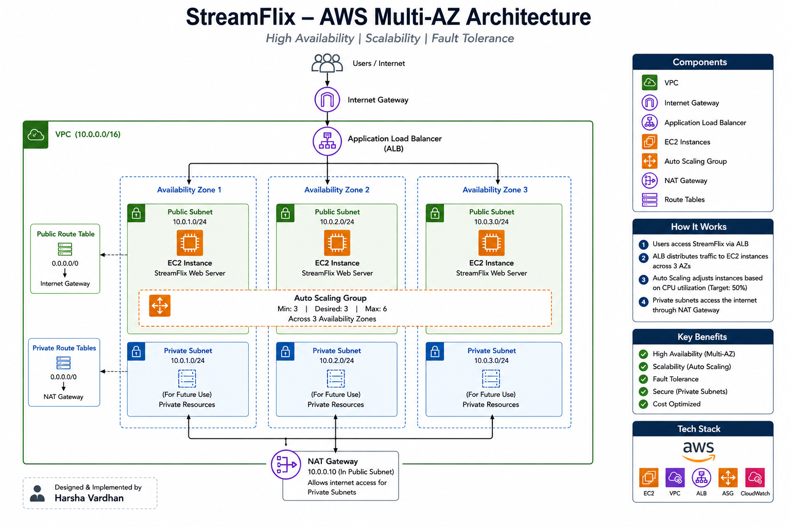

# StreamFlix Enterprise AWS Architecture

## Project Overview

This project demonstrates the deployment of a highly available and scalable StreamFlix web application on Amazon Web Services (AWS).

The infrastructure follows cloud architecture best practices by leveraging Multi-Availability Zone deployment, Load Balancing, and Auto Scaling to ensure high availability, fault tolerance, and scalability.

## Architecture Diagram

## Architecture Components

### Networking

* Amazon VPC
* 3 Availability Zones
* 3 Public Subnets
* 3 Private Subnets
* Internet Gateway
* NAT Gateway
* Route Tables

### Compute

* Amazon EC2
* Apache2 Web Server
* StreamFlix Web Application

### High Availability

* Application Load Balancer (ALB)
* Target Group
* Multi-AZ Deployment

### Scalability

* Auto Scaling Group
* Launch Template
* Amazon Machine Image (AMI)
* CloudWatch Metrics

## Traffic Flow

1. Users access the StreamFlix application.
2. Requests reach the Application Load Balancer.
3. The Load Balancer distributes traffic across EC2 instances in multiple Availability Zones.
4. Auto Scaling automatically launches or terminates instances based on CPU utilization.
5. Private resources access the internet through the NAT Gateway.

## Auto Scaling Configuration

| Setting          | Value                   |
| ---------------- | ----------------------- |
| Minimum Capacity | 3                       |
| Desired Capacity | 3                       |
| Maximum Capacity | 6                       |
| Scaling Metric   | Average CPU Utilization |
| Target Value     | 50%                     |

## AWS Services Used

* Amazon VPC
* Amazon EC2
* Application Load Balancer
* Auto Scaling Group
* Launch Templates
* Amazon Machine Image (AMI)
* NAT Gateway
* Internet Gateway
* CloudWatch

## Key Features

* High Availability
* Multi-AZ Deployment
* Automatic Scaling
* Load Balancing
* Fault Tolerance
* Secure Network Segmentation
* Cost Optimization

## Future Enhancements

* Route 53 Custom Domain
* AWS Certificate Manager (HTTPS)
* Amazon CloudFront
* Amazon S3 Static Assets
* CI/CD Pipeline using Jenkins
* Docker Containerization
* Amazon EKS Deployment

## Author

Harsha Vardhan

Cloud Computing | AWS | DevOps | Infrastructure Engineering
